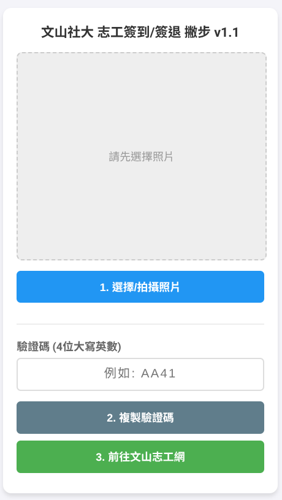

# 文山社大 志工簽到/簽退 助手 v1.1

這是一個專為「文山社區大學」志工設計的輔助工具，旨在優化手機端簽到流程。

### 🌟 核心功能
* **照片放大鏡**：支援單指平移與雙指縮放（Pinch-to-Zoom），方便看清驗證碼照片。
* **快速複製**：輸入驗證碼後可一鍵複製，減少切換視窗時的記憶負擔。
* **直達連結**：內建按鈕可快速跳轉至文山志工網。

### 🚀 如何使用
1. 拍攝或選擇志工簽到處的驗證碼照片。
2. 在工具中縮放檢視驗證碼並輸入至欄位。
3. 點擊「複製驗證碼」並前往志工網貼上即可。

### 🛠️ 技術棧
* 原生 HTML5 / CSS3 (Flexbox, CSS Variables)
* Vanilla JavaScript (Touch Events API)

